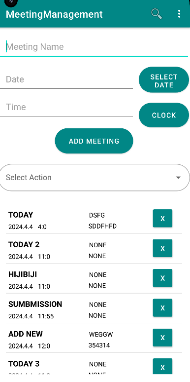
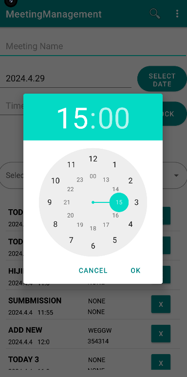

<h1>Meeting Management App: </h1>   

    Basic Meeting Management Android App
    <ul>
      <h2> Functionalities</h2>
      <li>
        App Landing Page: Helps with adding meeting to the list.
      </li>
      <li>
        View All Meetings: Fetches all meetings existing in the persistent memory
      </li>
      <li>
        View Today's Meetings: Fetches all the meeting from today
      </li>
      <li>
        View Tomorrow's Meetings: Fetches all meetings happening the next day.
      </li>
      <li>
        Clear All Meetings: Deletes all meetings from the memory
      </li>
      <li>
        Clear All Meetings for Today: Removes today's date based listed meetings from the memory
      </li>
      <li>
        Push Meetings: Pushes meetings to the next available weekdays.
      </li>
      
      
    </ul>

